<!--horizontal divider(gradiant)-->

<!--h1 without bottom border-->

  <ul align="center">
    
<h1 style="display: inline-block">Hi 👋, I'm Karim Yasser</h1>

  </ul>

<!--Intro start-->

- 🧑‍🎓 **Computer Engineer** at Cairo University with 2+ years of experience in mobile, web & ML development.
- � **Software Developer** @ [I'SUPPLY](https://github.com/KarimmYasser) — 🏆 Won 1st place in a 30+ team hackathon!
- 🎓 **Session Lead** @ Udacity (DECI) | **Resource Management** @ Enactus Cairo University
- 📱 Expert in **Flutter** (Mobile & Desktop), **Android** (Kotlin, Jetpack Compose), and **React Native** (Expo).
- 🤖 Certified **IBM Data Scientist** — Python, ML, MLOps with MLflow & HuggingFace.
- 🧠 Passionate about **Problem Solving** on [LeetCode](https://leetcode.com/KarimmYasser/) & competitive programming.
- 🛠️ **Tech Stack:** Dart, Kotlin, Python, TypeScript, C++, SQL, Flutter, React Native, Firebase, Supabase
- 📬 Reach me at **karimmyasserr@gmail.com** | 🌐 [Portfolio](https://karim-yasser.vercel.app)
- 💬 Discord → [KarimmYasser](https://discordapp.com/users/karimmyasser)

<!--Intro end-->

<!-- Snake animation -->

  

<!-- GitHub Metrics -->

  <ul align="center">
    
<h2 style="display: inline-block">GitHub Stats 📊</h2>

  </ul>

  

<!-- Achievements -->

  

<!-- Languages -->

  
  

<!-- Coding Habits -->

  

<!-- Starred Languages -->

  

<!-- Isocalendar -->

  

<!-- Code Snippet -->

  

<!-- Tech Stack -->

  <ul align="center">
    
<h2 style="display: inline-block">Technologies That I Know 👨🏻‍💻</h2>

  </ul>

  

<!-- LeetCode / Problem Solving Section -->

  <ul align="center">
    
<h2 style="display: inline-block">Problem Solving & Competitive Programming 🧠</h2>

  </ul>

  I enjoy solving algorithmic challenges and improving my coding skills on platforms like <strong>LeetCode</strong>. 
  I'm passionate about <strong>data structures, algorithms, and computational geometry</strong>.

  

  
   
  <a href="https://leetcode.com/KarimmYasser/" target="blank">
    🔗 Visit My LeetCode Profile
  </a>

<!-- Featured Projects -->

  <ul align="center">
    
<h2 style="display: inline-block">Featured Projects 🚀</h2>

  </ul>

<table align="center">
  <tr>
    <td align="center" width="50%">
      <a href="https://github.com/KarimmYasser/isupply_app"><b>🏆 i'Supply POS App</b></a> 
      Flutter • Hive • Supabase 
      1st Place Hackathon Winner - Cross-platform POS system with offline sync
    </td>
    <td align="center" width="50%">
      <a href="https://github.com/KarimmYasser/yapper-mobile"><b>📱 Yapper - X Clone</b></a> 
      React Native • Expo • WebSocket 
      Real-time messaging, RTL support, AI summarization, CI/CD
    </td>
  </tr>
  <tr>
    <td align="center" width="50%">
      <a href="https://github.com/KarimmYasser/Walmart-Sales-Forecasting-ML"><b>📊 Walmart Sales Forecasting</b></a> 
      Python • Scikit-learn • MLflow • Docker 
      ML pipeline with 99.96% R² accuracy, FastAPI & Streamlit deployment
    </td>
    <td align="center" width="50%">
      <a href="https://github.com/KarimmYasser/VLSI-Convolution-Systolic-Accelerator"><b>⚡ VLSI Systolic Accelerator</b></a> 
      Verilog • OpenLane • SKY130 PDK 
      8x8 systolic array for neural network inference
    </td>
  </tr>
  <tr>
    <td align="center" width="50%">
      <a href="https://github.com/KarimmYasser/stall_3alda2ery"><b>🖥️ 5-Stage Pipelined Processor</b></a> 
      VHDL • Python 
      32-bit processor with hazard handling & branch prediction
    </td>
    <td align="center" width="50%">
      <a href="https://github.com/KarimmYasser/portfolio"><b>🌐 Portfolio Website</b></a> 
      React • TypeScript • Three.js 
      Animated portfolio with 3D background & Framer Motion
    </td>
  </tr>
</table>

  

<!-- Connect with me -->

  <ul align="center">
    
<h2 style="display: inline-block">Connect With Me 🤝</h2>

  </ul>

  
   
  
  

  
  

<!--horizontal divider(gradiant)-->

