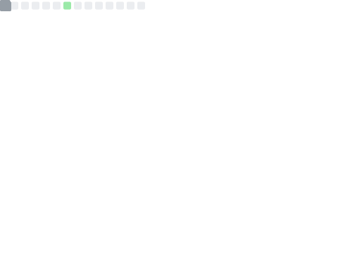
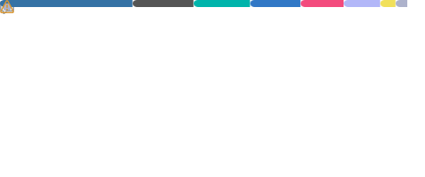
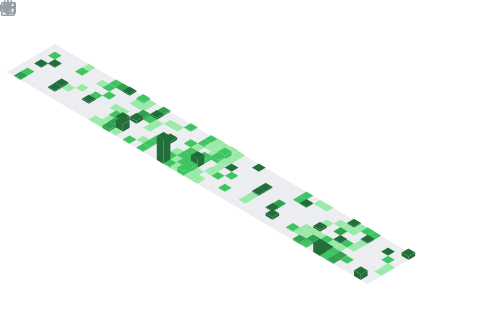

<!--horizontal divider(gradiant)-->

<!--h1 without bottom border-->

  <ul align="center">
    
<h1 style="display: inline-block">Hi 👋, I'm Karim Yasser</h1>

  </ul>

<!--Intro start-->

- 🧑‍🎓 **Computer Engineering** student @ Cairo University (2022-2027) with **2+ years** of professional experience.
- 🎮 **Systems Architect** - Developed a high-performance **C++17/OpenGL** Game Engine & **Verilog** VLSI accelerators.
- 🤖 **Agentic AI Specialist** - Researching **Multimodal Evaluation** (GSoC 2026) and building autonomous agents with **LangGraph**.
- 🏆 **1st Place** - [ODC x INSTANT AI Hackathon](https://github.com/KarimmYasser/braTs-ai-hackathon-ODCxINSTANT) (Brain Tumor Segmentation).
- 🏆 **1st Place** - [I'SUPPLY Hackathon](https://github.com/KarimmYasser/isupply_app) (30+ teams), earning a full-time offer.
- 💼 **Agentic AI Trainee** @ ODC Egypt | **Software Developer** @ I'SUPPLY | **Session Lead** @ Udacity.
- 🧠 **IBM Certified Data Scientist** - Expert in **MLOps** (MLflow, Docker) and **Rust-powered** feature engineering.
- 📬 Reach me at **karimmyasserr@gmail.com** | 🌐 [Portfolio](https://karim-yasser.vercel.app)

<!--Intro end-->

<!-- Snake animation -->

  

<!-- GitHub Metrics -->

  <ul align="center">
    
<h2 style="display: inline-block">GitHub Stats 📊</h2>

  </ul>

  

<!-- Languages -->

  

<!-- Isocalendar -->

  

<!-- Experience Section -->

  <ul align="center">
    
<h2 style="display: inline-block">Professional Experience 💼</h2>

  </ul>

<table align="center">
  <tr>
    <th>Role</th>
    <th>Organization</th>
    <th>Period</th>
  </tr>
  <tr>
    <td>🤖 Agentic AI Trainee</td>
    <td>Orange Digital Center Egypt</td>
    <td>Feb 2026 - Apr 2026</td>
  </tr>
  <tr>
    <td>🎓 Session Lead</td>
    <td>Udacity (DECI)</td>
    <td>Nov 2025 - Mar 2026</td>
  </tr>
  <tr>
    <td>💻 Software Developer</td>
    <td>I'SUPPLY</td>
    <td>Jul 2025 - Dec 2025</td>
  </tr>
  <tr>
    <td>📊 Data Science Trainee</td>
    <td>DEPI (IBM Certified)</td>
    <td>Jun 2025 - Dec 2025</td>
  </tr>
  <tr>
    <td>📱 Android Developer Intern</td>
    <td>Banque Misr</td>
    <td>Jul 2025 - Sep 2025</td>
  </tr>
  <tr>
    <td>🤖 Mobile Dev Intern (Flutter & ML)</td>
    <td>Informatique</td>
    <td>Jul 2025 - Aug 2025</td>
  </tr>
  <tr>
    <td>👨‍🏫 Flutter Instructor</td>
    <td>IEEE Cairo University SB</td>
    <td>Feb 2025 - May 2025</td>
  </tr>
</table>

<!-- Tech Stack -->

  <ul align="center">
    
<h2 style="display: inline-block">Technical Arsenal 👨🏻‍💻</h2>

  </ul>

<!-- AI & ML -->
<h4 align="center">🤖 Agentic AI & Machine Learning</h4>

  
   
  <code>LangGraph</code> • <code>LangChain</code> • <code>Neo4j</code> • <code>LLM-as-a-Judge</code> • <code>MONAI</code> • <code>MLflow</code> • <code>FastAPI</code>

<!--  Systems & Game Engineering  -->
<h4 align="center">🎮 Systems & Game Engineering</h4>

  
   
  <code>Entity Component System (ECS)</code> • <code>FFmpeg</code> • <code>Miniaudio</code> • <code>Verilog</code> • <code>SKY130 PDK</code>

<!--  Mobile & Frontend  -->
<h4 align="center">📱 Mobile & Cross-Platform</h4>

  
   
  <code>Jetpack Compose</code> • <code>Riverpod</code> • <code>Flutter BLoC</code> • <code>React Native (Expo)</code>

<!--  Backend & Tools  -->
<h4 align="center">⚙️ Backend & Infrastructure</h4>

  

<!-- LeetCode / Problem Solving Section -->

  <ul align="center">
    
<h2 style="display: inline-block">Problem Solving 🧠</h2>

  </ul>

  I'm passionate about <strong>Data Structures, Algorithms, and Computational Geometry</strong>. 
  Active on <strong>LeetCode</strong> and exploring <strong>Post-Quantum Cryptography</strong>.

  

  <a href="https://leetcode.com/KarimmYasser/" target="blank">
    🔗 <b>Visit My LeetCode Profile</b>
  </a>

<!-- Featured Projects -->

  <ul align="center">
    
<h2 style="display: inline-block">Featured Engineering Feats 🚀</h2>

  </ul>

<table align="center">
  <tr>
    <td align="center" width="50%">
      <a href="https://github.com/KarimmYasser/aladdin-nasiras-revenge"><b>🎮 Aladdin: C++ Game Engine</b></a> 
      C++17 • OpenGL 3.3 • ECS • miniaudio 
      High-performance 3D engine with deferred lifecycle management, 16k shadow mapping, and GPU skinning.
    </td>
    <td align="center" width="50%">
      <a href="https://github.com/KarimmYasser/ai-eval-framework"><b>🔬 AI API Evaluation Framework</b></a> 
      GSoC 2026 • Multimodal AI • FastAPI 
      Research-driven platform for Agentic Workflows with Dual-Metric Scoring and Trace Viewer.
    </td>
  </tr>
  <tr>
    <td align="center" width="50%">
      <a href="https://github.com/KarimmYasser/machine-sound-classification"><b>🔊 Industrial Sound AI Pipeline</b></a> 
      Rust • PyO3 • XGBoost • EfficientAT 
      Cloud diagnostics achieve 95.61% accuracy. Rust engine provides 57x speedup in feature extraction.
    </td>
    <td align="center" width="50%">
      <a href="https://github.com/KarimmYasser/robot-wall-follower"><b>🤖 Autonomous Wall-Following Robot</b></a> 
      Embedded C • ATmega328P • PID Control 
      Interrupt-driven architecture with Cascaded PID loops and FSM for autonomous navigation.
    </td>
  </tr>
  <tr>
    <td align="center" width="50%">
      <a href="https://github.com/KarimmYasser/braTs-ai-hackathon-ODCxINSTANT"><b>🧠 BioMedIAMBZ – Brain Tumor Segmentation</b></a> 
      🏆 1st Place • PyTorch • MONAI • MedNeXt 
      3D segmentation pipeline with 40x faster preprocessing and real-time mobile inference.
    </td>
    <td align="center" width="50%">
      <a href="https://github.com/KarimmYasser/hash-clash-keys-please"><b>🔐 Cryptographic Hash Research</b></a> 
      BLAKE-256 • ARX • Security Analysis 
      Custom security test suite evaluating diffusion speed vs structural integrity. Patching LEA vulnerabilities.
    </td>
  </tr>
  <tr>
    <td align="center" width="50%">
      <a href="https://github.com/KarimmYasser/isupply_app"><b>🏆 i'Supply POS Ecosystem</b></a> 
      🏆 1st Place • Flutter • Hive • Supabase 
      Production-ready POS with offline sync and paginated search for 1000+ products.
    </td>
    <td align="center" width="50%">
      <a href="https://github.com/KarimmYasser/VLSI-Convolution-Systolic-Accelerator"><b>⚡ VLSI Systolic Accelerator</b></a> 
      Verilog • OpenLane • SKY130 PDK 
      8x8 systolic array for neural network inference. Full RTL-to-GDSII flow via OpenLane.
    </td>
  </tr>
</table>

  

<!-- Connect with me -->

  <ul align="center">
    
<h2 style="display: inline-block">Connect With Me 🤝</h2>

  </ul>

  
   
  
  

  
  

<!--horizontal divider(gradiant)-->

